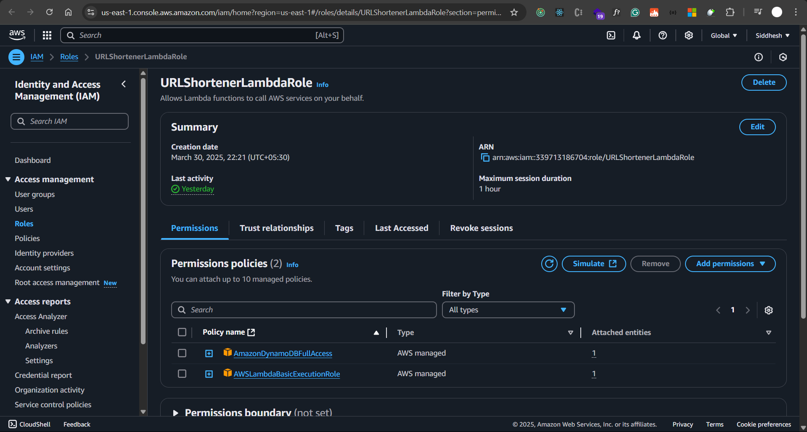

# URL Shortener Project

## Overview
This project is a serverless URL shortener using AWS services such as API Gateway, AWS Lambda, and DynamoDB. The system allows users to shorten long URLs and later access them using a shortened link.

## Architecture
1. **API Gateway**: Acts as an entry point for the API requests.
2. **AWS Lambda**: Processes incoming API requests for both shortening and retrieving URLs.
3. **DynamoDB**: Stores the mappings of short codes to long URLs.

## Workflow
### 1. Shorten a URL (POST Request)
- **Endpoint:** `https://your-api-gateway-url/prod/shorten`
- **Method:** `POST`
- **Request Body:**
  ```json
  {
    "longURL": "https://www.example.com"
  }
  ```
- **Process:**
  - API Gateway triggers the Lambda function.
  - Lambda generates a random short code.
  - The short code and long URL are stored in DynamoDB.
  - The response contains the shortened URL.
- **Response Example:**
  ```json
  {
    "shortURL": "https://your-api-gateway-url/prod/abc123"
  }
  ```

### 2. Retrieve the Long URL (GET Request)
- **Endpoint:** `https://your-api-gateway-url/prod/{shortCode}`
- **Method:** `GET`
- **Process:**
  - API Gateway triggers the Lambda function.
  - Lambda looks up the `shortCode` in DynamoDB.
  - If found, it returns a 301 redirect to the original long URL.
- **Response Example (Redirects to original URL):**
  ```
  HTTP/1.1 301 Moved Permanently
  Location: https://www.example.com
  ```

## AWS Lambda Function
### Lambda Code:
```javascript
import { DynamoDBClient } from "@aws-sdk/client-dynamodb";
import { DynamoDBDocumentClient, GetCommand, PutCommand } from "@aws-sdk/lib-dynamodb";

const client = new DynamoDBClient({});
const dynamoDB = DynamoDBDocumentClient.from(client);
const tableName = "ShortURLs";
const baseUrl = "https://40hj1tpba6.execute-api.us-east-1.amazonaws.com/prod";

export const handler = async (event) => {
    if (event.httpMethod === "POST") {
        const { longURL } = JSON.parse(event.body);
        
        const shortCode = Math.random().toString(36).slice(2, 8);

        await dynamoDB.send(new PutCommand({
            TableName: tableName,
            Item: { shortCode, longURL }
        }));

        return {
            statusCode: 200,
            body: JSON.stringify({ shortURL: baseUrl + "/" + shortCode }),
        };
    } else if (event.httpMethod === "GET") {
        const shortCode = event.pathParameters.shortCode;
        
        const data = await dynamoDB.send(new GetCommand({
            TableName: tableName,
            Key: { shortCode }
        }));

        if (!data.Item) {
            return { statusCode: 404, body: "Short URL not found" };
        }

        return {
            statusCode: 301,
            headers: { Location: data.Item.longURL },
            body: ""
        };
    }
    
    return { statusCode: 400, body: "Invalid request" };
};
```


## API Gateway Setup
### Routes:
- **POST `/shorten`** → Triggers Lambda to shorten a URL.
- **GET `/{shortCode}`** → Triggers Lambda to retrieve and redirect to the original URL.

### Integration Type:
- **REST API (Recommended)**


## DynamoDB Table Structure
- **Table Name:** `ShortURLs`
- **Primary Key:** `shortCode` (String)
- **Attributes:**
  - `shortCode` (Primary Key)
  - `longURL` (String)


## Testing with Postman
### 1. Test Shorten URL (POST)
- **Method:** `POST`
- **URL:** `https://your-api-gateway-url/prod/shorten`
- **Headers:** `Content-Type: application/json`
- **Body:**
  ```json
  {
    "longURL": "https://www.example.com"
  }
  ```
- **Expected Response:**
  ```json
  {
    "shortURL": "https://your-api-gateway-url/prod/abc123"
  }
  ```


### 2. Test Redirect (GET)
- **Method:** `GET`
- **URL:** `https://your-api-gateway-url/prod/abc123`
- **Expected Response:** Redirects to the original URL.


## IAM Roles For Lambda:



## Conclusion
This project successfully implements a serverless URL shortener using AWS services. It provides a scalable and cost-effective solution for generating and resolving shortened URLs.


