# 🛒 Order Processing Project - AWS Step Function

## Overview
A lightweight, serverless order workflow using API Gateway, Lambda, Step Functions, SES and DynamoDB. It receives order data via an API, processes the request in sequence (create, pay, confirm), and logs everything efficiently.

## Architecture

The system follows a serverless event-driven architecture using AWS managed services.

### Workflow Overview
1. Client/API Gateway triggers the `stateMachine` Lambda with order details using a RESTful API.
2. This Lambda initiates the Step Function, passing the payload.

  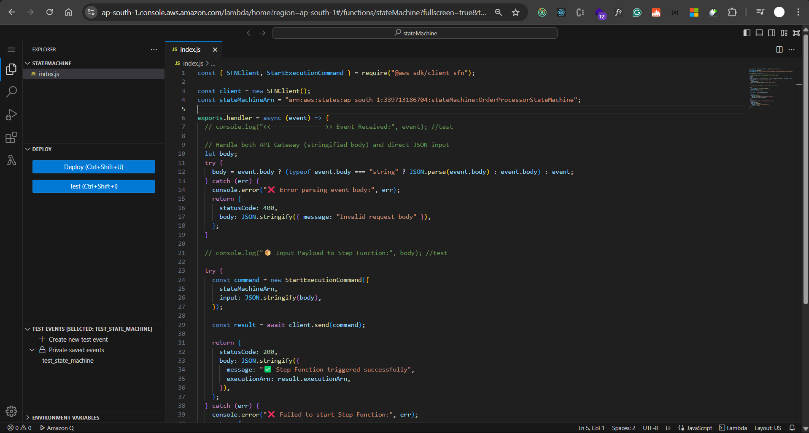
  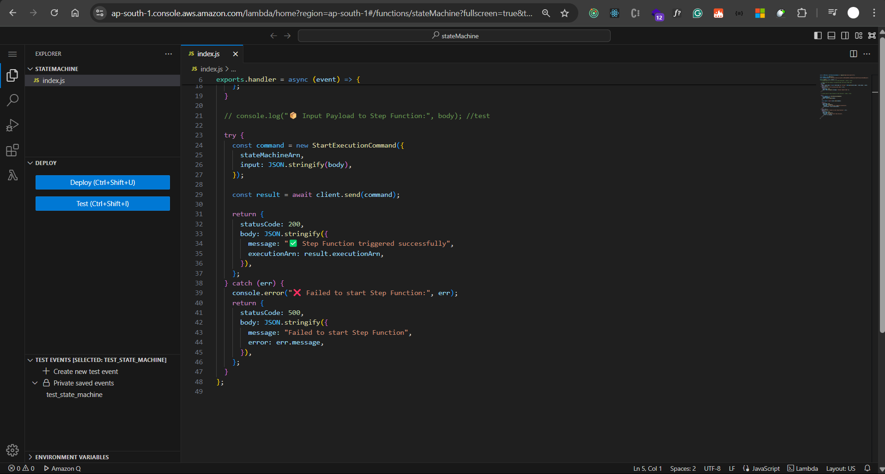

### Step Function Orchestration
The Step Function (`OrderProcessorStateMachine`) coordinates the following steps:

- `ValidateOrder` → Validates order inputs.
  
  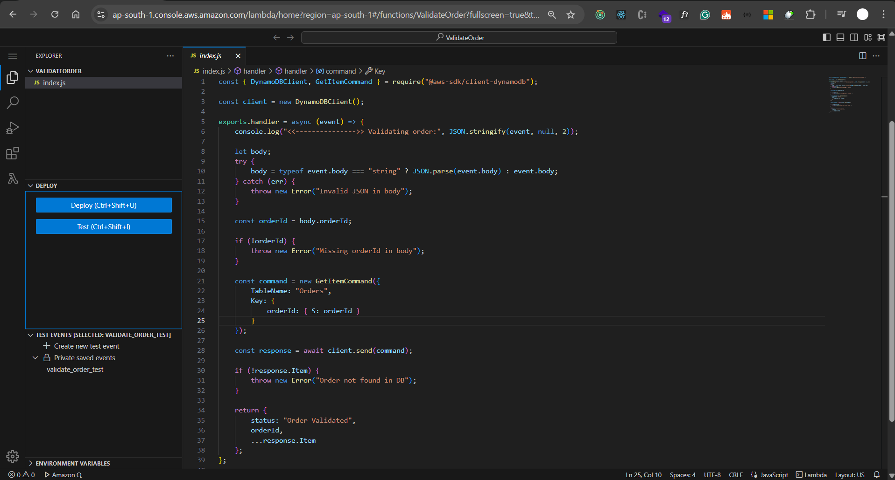

- `UpdateInventory` → Updates product stock in DynamoDB.
 
  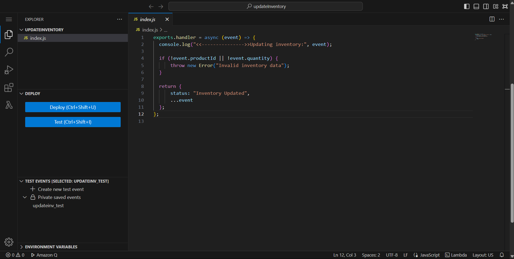

- `CreateOrder` → Persists the order data in DynamoDB.

  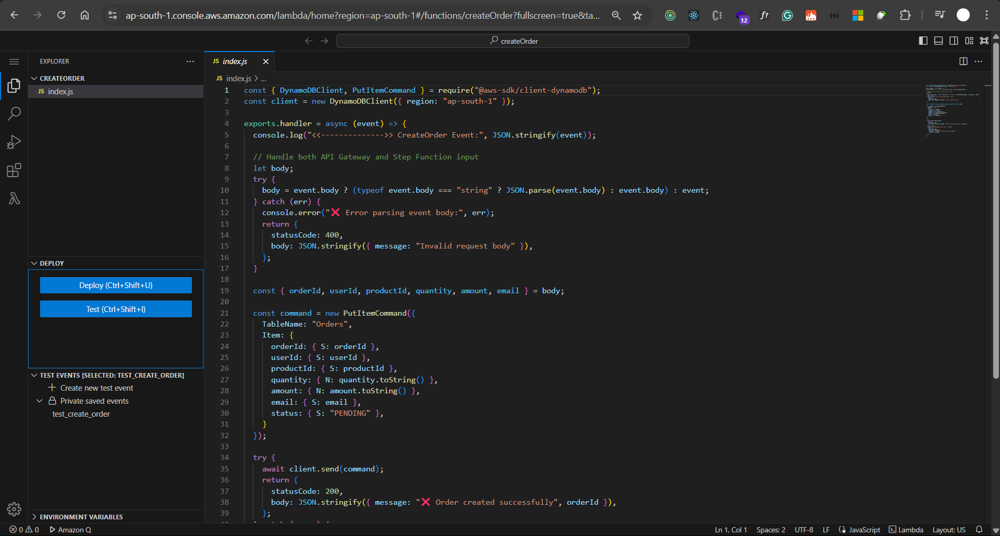

- `ProcessPayment` → Simulates payment logic.

  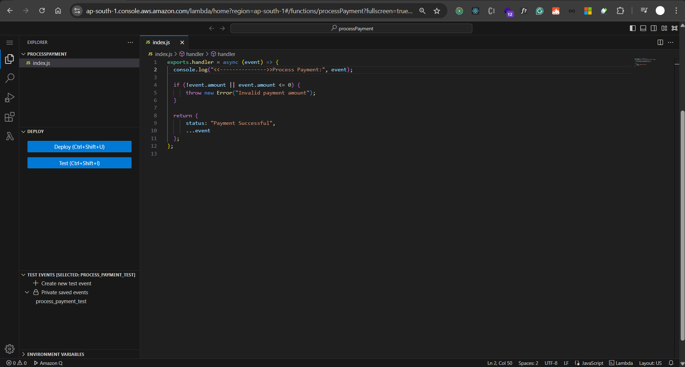

- `SendConfirmation` → Sends email via AWS SES.
 
  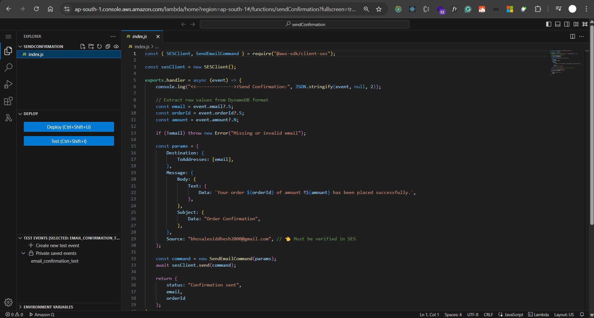

- `handleFailure` → Handles any failure across the steps.

  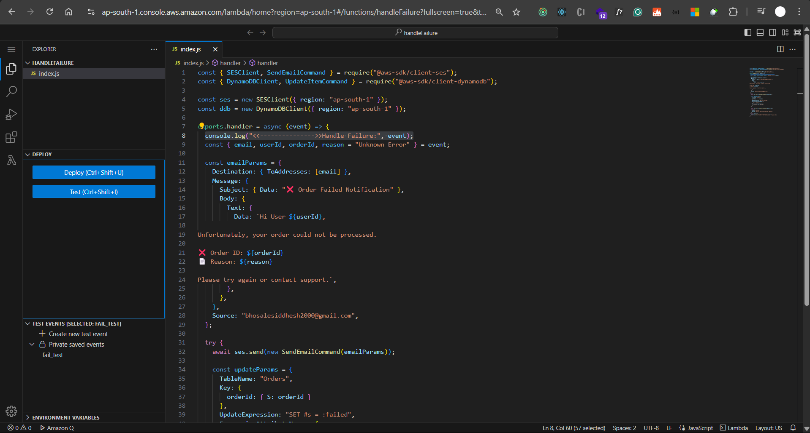
  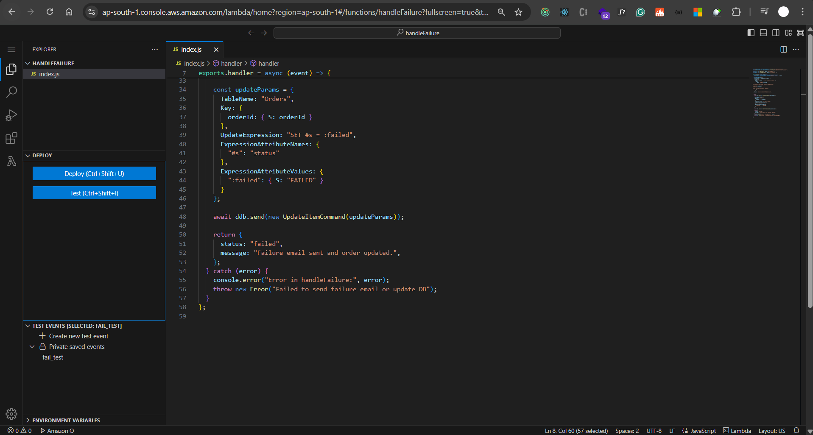

### AWS Services Involved
**API Gateway (REST API)** Entry point for HTTP requests using RESTful endpoints.

  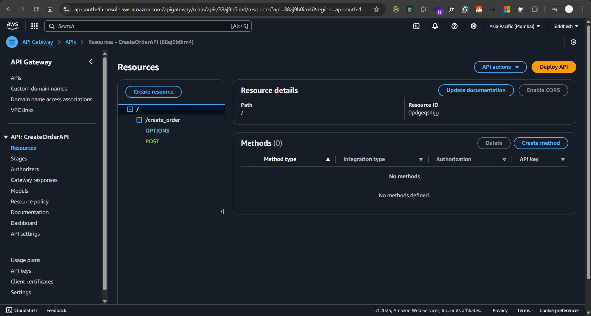

**Lambda:** Handles each functional unit.

**Step Function:** Orchestrates workflow.

**DynamoDB:** Stores order and inventory data.

   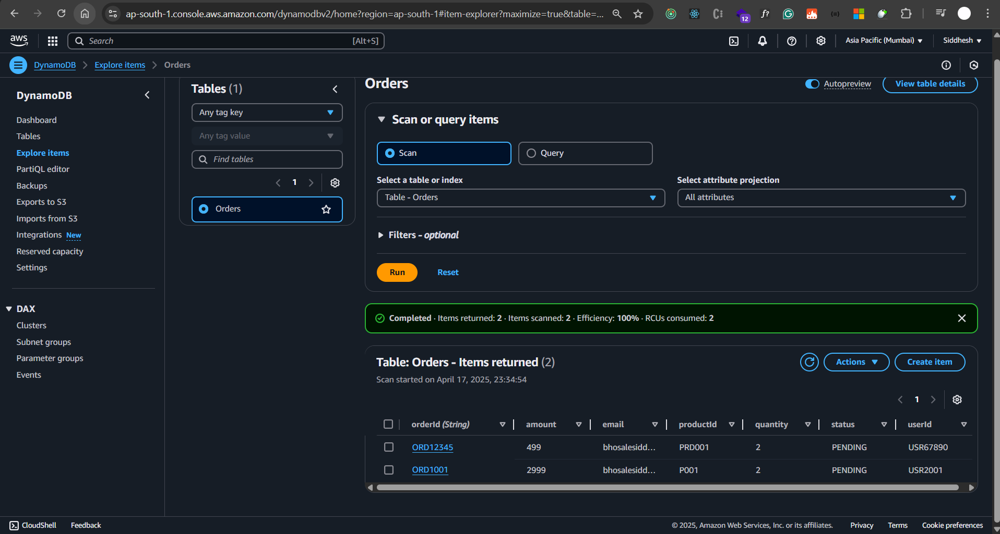
   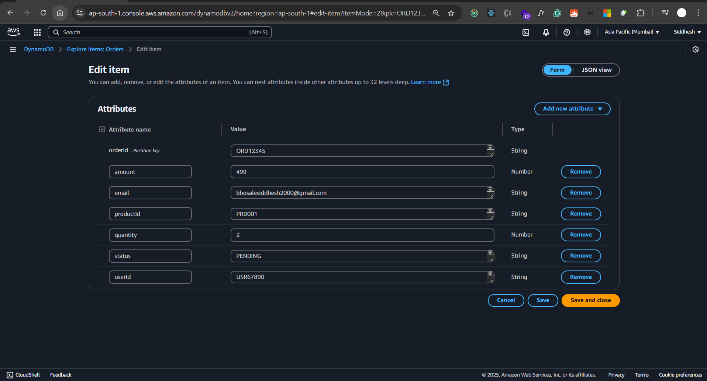

**SES:** Sends confirmation emails.

   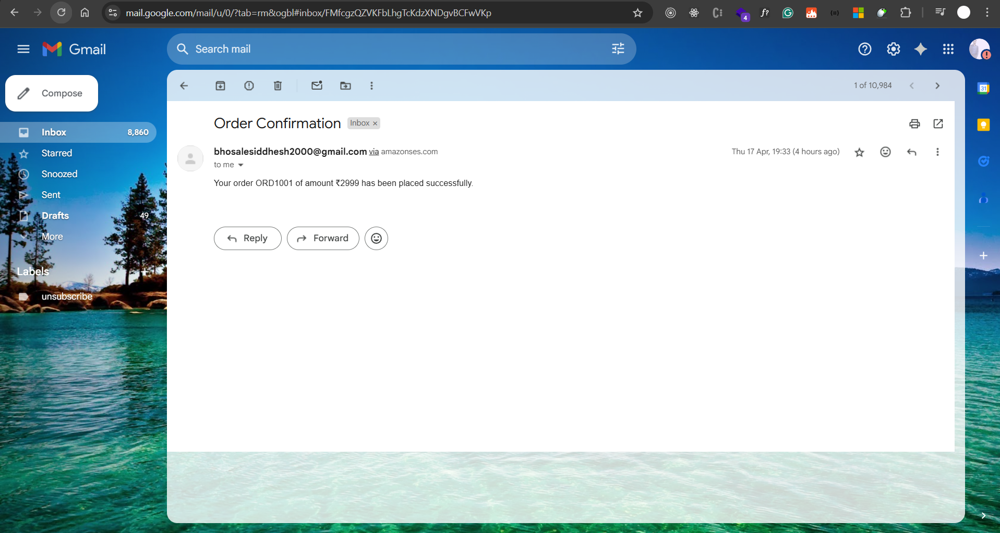

### Postman URL Test

  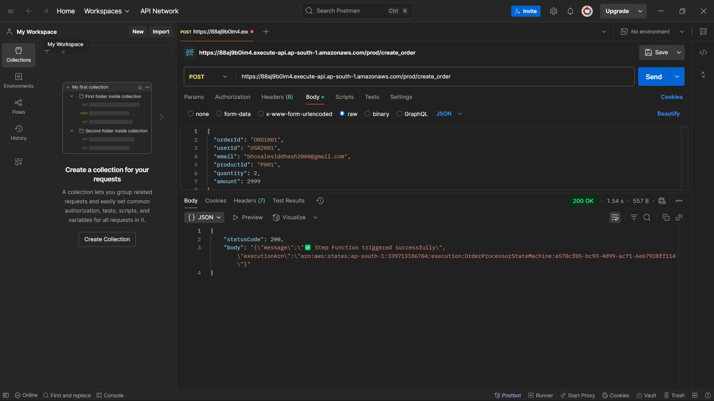

### Result

  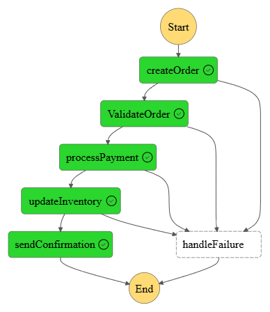

### Benefits
- Modular microservices design

- Clear separation of concerns

- Easy debugging and monitoring with Step Function console

- Scalable and extensible architecture

## Conclusion
This serverless order processing system uses AWS Step Functions and Lambda for a scalable, event-driven architecture. By breaking the workflow into modular Lambda functions for tasks like order creation, payment processing, and failure handling, it ensures better maintainability and reusability. Step Functions orchestrate tasks with minimal effort, handling retries, failures, and transitions. This design enhances reliability, performance, and reduces operational complexity, making it a solid foundation for further extensions like notifications or analytics.

